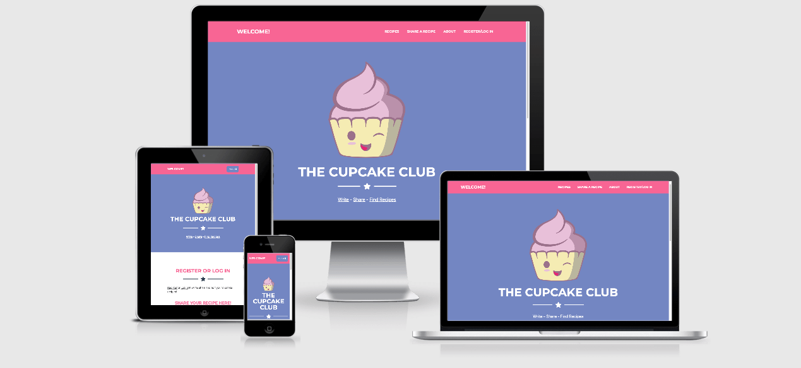

# **The Cupcake Club**

## **Goal for this project**
Welcome to [The Cupcake Club](https://cupcake-club.herokuapp.com)!

This website was created to allow visitors to write, share and find cupcake recipes. An online collection of various cupcake recipes that allows cupcake-lovers to browse, share, add or edit recipes, all wrapped into a fun and modern design.

The website has a user-friendly layout and provides easy access to all necessary information.

Thank you for visiting!

Should you have any questions regarding my project feel free to reach out to me via the provided GitHub contact details.

## Table of contents 
- [**The Cupcake Club**](#the-cupcake-club)
  - [**Goal for this project**](#goal-for-this-project)
  - [Table of contents](#table-of-contents)
  - [**UX**](#ux)
    - [User Goal](#user-goal)
    - [User Stories](#user-stories)
    - [Site Owner's Goals](#site-owners-goals)
    - [Design Choices](#design-choices)
    - [Colours](#colours)
    - [Structure](#structure)
    - [Logo](#logo)
    - [Background](#background)
    - [Fonts](#fonts)
    - [Icons](#icons)
    - [Wireframes](#wireframes)
      - [Desktop Wireframes](#desktop-wireframes)
      - [Tablet Wireframes](#tablet-wireframes)
      - [Mobile Wireframes](#mobile-wireframes)
      - [Additional wireframes](#additional-wireframes)
    

## **UX**

### User Goal
* A recipe collection containing information about how to make cupcakes.
* A fully responsive website that is accessible and easy to use on desktop, tablet & mobile.
* Appealing, modern and clear design.
* Visibility of my own recipes, and an easy way to edit or delete these.
* Providing option to share recipes on social media.
* Direct links to social media sites.

[Back to Top](#table-of-contents)

### User Stories
* As a user, I want to be able to register to the website so I can access write and submit my own recipes.
* As a user, I want to be able to log in with my account and access my previous recipes.
* As a user, I want a simple way to edit or delete my previous recipes.
* As a user, I want to be able to share recipes from the website on social media.
* As a user, I want to be able to see the most recent recipes first.
* As a user, I want text and images to appear clear and visible.
* As a user, I want the website to be easy to navigate.
* As a user, I want the website to be available on mobile, tablet and desktop devices.

[Back to Top](#table-of-contents)

### Site Owner's Goals
* Providing information about how to make cupcakes. 
* Providing a fully responsive and enjoyable interface with great functionality for users to write, share and find recipes.
* To make the website as personal as possible by giving the user the possibility to customise their recipe avatar and add and access their own recipes on a separated page.

[Back to Top](#table-of-contents)

### Design Choices
The website's main functionalities to add, share and find cupcake recipes. The design choices reflect a fun and modern design with bold colours while keeping the flow clear and simple for users. 

### Colours

The colour palette was created via [Coolors](https://coolors.co/ "Coolors.co")

* #FFFFFF: The background of the overall website is white in order achieve a clean nad modern look. 
* #7386C2: This colour is used as background colour in different sections. 
* #D63384: This color is used in the navbar and certain texts to draw user's attention to it.
* #2C3E50: This colour is used as a feature colour in dividers across the website as well as in the footer.

### Structure

The website's structure was created with the use of [Bootstrap 5](https://getbootstrap.com/) and a free template from [Start Bootstrap](https://startbootstrap.com/previews/freelancer) to ensure compatibility across various devices.

### Logo

The cupcake logo was created by ***Tamas Barta*** Graphic Designer.

### Background

The background image is created via [Patternico](https://patternico.com).

### Fonts

Fonts are customised via [Google Fonts](https://fonts.google.com)

### Icons

Fav icons are created via [Favicon.io](https://favicon.io/favicon-generator/) 

[Back to Top](#table-of-contents)

### Wireframes

The website's wireframes were created via [Balsamiq](https://balsamiq.com/wireframes/).

Wireframes are available on the links below:

#### Desktop Wireframes
* [Home](assets/wireframes/home_desktop.png)
* [Login](/assets/wireframes/login_desktop.png)
* [Register](/assets/wireframes/register_desktop.png)
* [Recipe form](/assets/wireframes/recipe_form_desktop.png)
* [Edit recipe form](/assets/wireframes/edit_recipe_desktop.png)
* [My recipes](assets/wireframes/my_recipes_desktop.png)
* [Recipes](/assets/wireframes/recipes_desktop.png)
* [Recipe details](/assets/wireframes/recipe_details_desktop.png)

#### Tablet Wireframes
* [Home](assets/wireframes/home_tablet.png)
* [Login](/assets/wireframes/login_tablet.png)
* [Register](/assets/wireframes/register_tablet.png)
* [Recipe form](/assets/wireframes/recipe_form_tablet.png)
* [Edit recipe form](/assets/wireframes/edit_recipe_tablet.png)
* [My recipes](assets/wireframes/my_recipes_tablet.png)
* [Recipes](/assets/wireframes/recipes_tablet.png)
* [Recipe details](/assets/wireframes/recipe_details_tablet.png)

#### Mobile Wireframes
* [Home](assets/wireframes/home_mobile.png)
* [Login](/assets/wireframes/login_mobile.png)
* [Register](/assets/wireframes/register_mobile.png)
* [Recipe form](/assets/wireframes/recipe_form_mobile.png)
* [Edit recipe form](/assets/wireframes/edit_recipe_mobile.png)
* [My recipes](assets/wireframes/my_recipes_mobile.png)
* [Recipes](/assets/wireframes/recipes_mobile.png)
* [Recipe details](/assets/wireframes/recipe_details_mobile.png)

#### Additional wireframes
* [Error page](/assets/wireframes/error_wireframe.png)
* [Toast message](/assets/wireframes/toast_message.png)

[Back to Top](#table-of-contents)